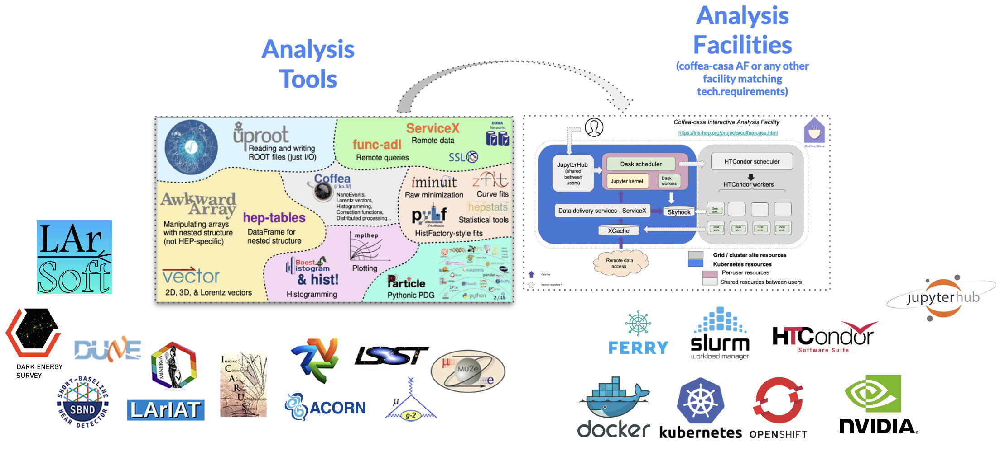

*********
Data Analysis Ecosystem?
*********

The Elastic Analysis Facility aims to provide a platform for rapid scientific analysis with modern web and container technologies. As such, Jupyterhub is designed to be the gateway to a diverse ecosystem encompassing data analysis software, services and libraries for all Fermilab experiments. 

Have an idea for a replicable environment that you would like to see on EAF? contact eaf-users@fnal.gov and we will be happy to collaborate on making it posible

The idea behind EAF
================

To unify and provide tools and development environments for HEP through a modern analysis facility. 
We are working closely and aligned with `IRIS-HEP https://iris-hep.org/`_ , a software institute funded by the National Science Foundation. It aims to develop the state-of-the-art software cyberinfrastructure required for the challenges of data intensive scientific research at the High Luminosity Large Hadron Collider (HL-LHC) at CERN, and other planned HEP experiments of the 2020’s

Current ecosystem
================
.. image:: img/eaf_ecosystem.png
  :alt: EAF current ecosystem

