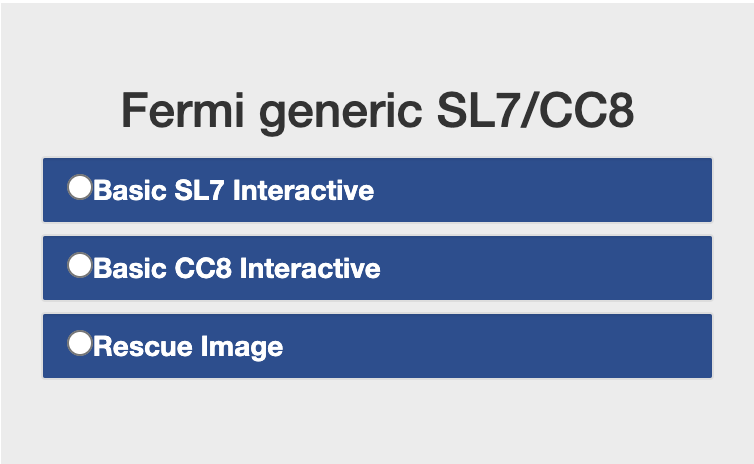
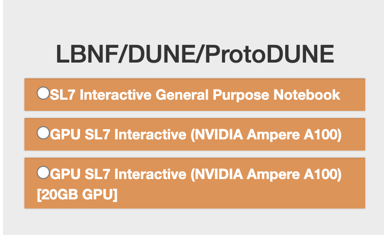
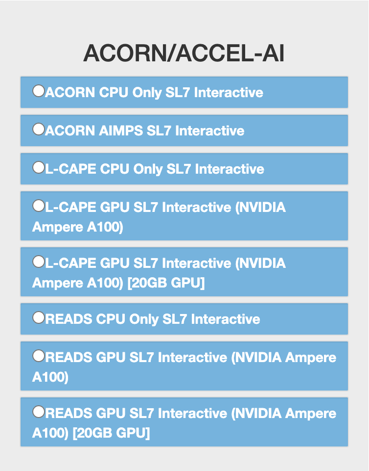
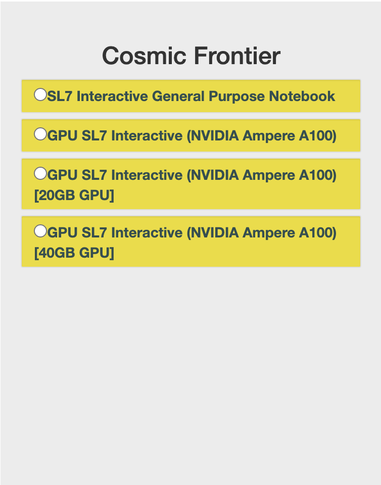

*********
Getting started - Choosing a Notebook
*********

Each experiment has different notebook options when starting a server and are grouped into the following: LBNF/DUNE/ProtoDUNE, FIFE/Neutrinos, ACORN/ACCEL-AI, Cosmic Frontier, CMSLPC, and Fermi Generic SL7. In general, only the notebooks where the user has an associated experiment should be available when selecting which to open. Users will also have access to the Fermi Generic SL7 notebooks.

`CMSLPC`_ - CMS, LHC

`Cosmic Frontier`_ - LSST, MAGIS-100, Mu2e, DES, DarkSide, Holometer

`ACORN/ACCEL-AI`_ - 

`FIFE/Neutrinos`_ - LArIAT, NOvA, MicroBooNE, MINERvA, ICARUS, SBND

`LBNF/DUNE/ProtoDUNE`_ - DUNE, LBNF

`Fermi Generic SL7/CC8`_ - Muon g-2

.. note::

   If you do not have access to your experiment, or have access to an experiment you are not apart of, please contact eaf-users@fnal.gov.

Fermi Generic SL7/CC8
=====================

   

.. important::
   
   The CC8 notebook will be removed in a future update and the rescue notebook, with instructions on how to use it, is documented here<>.

Basic SL7 Interactive
-----------------------
Image: fife-notebook

Packages
~~~~~~~~~~
.. table:: 
   :align: center
   
   +--------------------------------------+-------------------------------+------------------------------+---------------------------+-----------------------------+
   | .. centered:: krb5-workstation       | .. centered:: redhat-lsb-core | .. centered:: make           | .. centered:: nss_wrapper | .. centered:: libXext-devel |
   +--------------------------------------+-------------------------------+------------------------------+---------------------------+-----------------------------+
   | .. centered:: yum-plugin-priorities  | .. centered:: cmake3          | .. centered:: gcc-c++        | .. centered:: HTCondor    | .. centered:: libXpm-devel  | 
   +--------------------------------------+-------------------------------+------------------------------+---------------------------+-----------------------------+
   | .. centered:: xrootd-client-libs     | .. centered:: gcc             | .. centered:: binutils       | .. centered:: gettext     | .. centered:: libXft-devel  |    
   +--------------------------------------+-------------------------------+------------------------------+---------------------------+-----------------------------+
   | .. centered:: voms-client-cpp        | .. centered:: osg-wn-client   | .. centered:: libX11-devel   | .. centered:: voms        | .. centered:: openssl-devel |
   +--------------------------------------+-------------------------------+------------------------------+---------------------------+-----------------------------+
   | .. centered:: xrootd-client          | .. centered:: --              | .. centered:: --             | .. centered:: --          | .. centered:: --            |
   +--------------------------------------+-------------------------------+------------------------------+---------------------------+-----------------------------+

CVMFS
~~~~~~

.. table:: 
   :align: center
   
   +----------------------------------------------------+--------------------------------------------+
   | .. centered:: oasis.opensciencegrid.org            | .. centered:: fermilab.opensciencegrid.org | 
   +----------------------------------------------------+--------------------------------------------+
   | .. centered:: icarus.opensciencegrid.org           | .. centered:: lariat.opensciencegrid.org   | 
   +----------------------------------------------------+--------------------------------------------+
   | .. centered:: minerva.opensciencegrid.org          | .. centered:: minos.opensciencegrid.org    |
   +----------------------------------------------------+--------------------------------------------+
   | .. centered:: nova-development.opensciencegrid.org | .. centered:: nova.opensciencegrid.org     | 
   +----------------------------------------------------+--------------------------------------------+
   | .. centered:: sbn.opensciencegrid.org              | .. centered:: seaquest.opensciencegrid.org | 
   +----------------------------------------------------+--------------------------------------------+
   | .. centered:: gm2.opensciencegrid.org              | .. centered:: larsoft.opensciencegrid.org  |
   +----------------------------------------------------+--------------------------------------------+
   | .. centered:: mu2e.opensciencegrid.org             | .. centered:: sbnd.opensciencegrid.org     | 
   +----------------------------------------------------+--------------------------------------------+
   | .. centered:: uboone.opensciencegrid.org           | .. centered:: --                           |
   +----------------------------------------------------+--------------------------------------------+

For more detailed information regarding packages, check out the diagram in `EAF Structure and Packages`_. To look at only Fermi Generic SL7 images, toggle the "Background" and "Fife/Neutrinos" layers in the interactive diagram.

LBNF/DUNE/ProtoDUNE
=====================

ere A100) [20GB GPU].

SL7 Interactive General Purpose Notebook
-----------------------------------------
Image: dune-notebook

Packages
~~~~~~~~~~

.. table:: 
   :align: center
   
   +---------------------------------------+-------------------------------+------------------------+-----------------------------+--------------------------------+
   | .. centered:: yum-plugin-priorities   | .. centered:: redhat-lsb-core | .. centered:: cmake3   | .. centered:: libcurl-devel | .. centered:: perl-Digest-MD5  |
   +---------------------------------------+-------------------------------+------------------------+-----------------------------+--------------------------------+
   | .. centered:: libX11-devel            | .. centered:: nss_wrapper     | .. centered:: gettext  | .. centered:: gl2ps-devel   | .. centered:: gcc              |
   +---------------------------------------+-------------------------------+------------------------+-----------------------------+--------------------------------+
   | .. centered:: osg-wn-client           | .. centered:: xrootd-client   | .. centered:: voms     | .. centered:: subversion    | .. centered:: voms-clients-cpp | 
   +---------------------------------------+-------------------------------+------------------------+-----------------------------+--------------------------------+
   | .. centered:: xrootd-client-libs      | .. centered:: perl-DBD-SQLite | .. centered:: libtool  | .. centered:: ftgl-devel    | .. centered:: gdbm-devel       | 
   +---------------------------------------+-------------------------------+------------------------+-----------------------------+--------------------------------+
   | .. centered:: perl-ExtUtils-MakeMaker | .. centered:: glew-devel      | .. centered:: xz-devel | .. centered:: pcre2-devel   | .. centered:: readline-devel   | 
   +---------------------------------------+-------------------------------+------------------------+-----------------------------+--------------------------------+
   | .. centered:: libjpeg-turbo-devel     | .. centered:: bzip2-devel     | .. centered:: asciidoc | .. centered:: libzstd-devel | .. centered:: texinfo          | 
   +---------------------------------------+-------------------------------+------------------------+-----------------------------+--------------------------------+
   | .. centered:: mesa-libGL-devel        | .. centered:: ncurses-devel   | .. centered:: xmlto    | .. centered:: libffi-devel  | .. centered:: xxhash-devel     | 
   +---------------------------------------+-------------------------------+------------------------+-----------------------------+--------------------------------+
   | .. centered:: libAfterImage-devel     | .. centered:: gcc-c++         | .. centered:: automake | .. centered:: libXi-devel   | .. centered:: libXt-devel      | 
   +---------------------------------------+-------------------------------+------------------------+-----------------------------+--------------------------------+
   | .. centered:: mesa-libGLU-devel       | .. centered:: tk-devel        | .. centered:: swig     | .. centered:: lz4-devel     | .. centered:: perl-Digest-SHA  | 
   +---------------------------------------+-------------------------------+------------------------+-----------------------------+--------------------------------+
   | .. centered:: glibc-devel.i686        | .. centered:: libstdc++.i686  | .. centered:: xxhash   | .. centered:: autoconf      | .. centered:: tcl-devel        | 
   +---------------------------------------+-------------------------------+------------------------+-----------------------------+--------------------------------+
   | .. centered:: giflib-devel            | .. centered:: perl-Digest     | .. centered:: HTCondor | .. centered:: binutils      | .. centered:: zstd             |
   +---------------------------------------+-------------------------------+------------------------+-----------------------------+--------------------------------+
   | .. centered:: libXmu-devel            | .. centered:: libgcc.i686     | .. centered:: --       | .. centered:: --            | .. centered:: --               |
   +---------------------------------------+-------------------------------+------------------------+-----------------------------+--------------------------------+

GPU SL7 Interactive (NVIDIA Ampere A100) and GPU SL7 Interactive (NVIDIA Ampere A100) [20GB GPU]
--------------------------------------------------------------------------------------------------
Image: dune-notebook (GPU)

Packages
~~~~~~~~~~

.. table:: 
   :align: center
   
   +------------------------------------------+---------------------------+---------------------------+---------------------+-------------------------+
   | .. centered:: jupyterlab-tensorboard-pro | .. centered:: torchvision | .. centered:: cudatoolkit | .. centered:: cudnn | .. centered:: yum-utils |
   +------------------------------------------+---------------------------+---------------------------+---------------------+-------------------------+
   | .. centered:: matplotlib-base            | .. centered:: nccl        | .. centered:: tqdm        | .. centered:: bokeh | .. centered:: pytorch   |
   +------------------------------------------+---------------------------+---------------------------+---------------------+-------------------------+
   | .. centered:: tensorflow-gpu             | .. centered:: nvcc        | .. centered:: cython      | .. centered:: h5py  | .. centered:: sympy     |
   +------------------------------------------+---------------------------+---------------------------+---------------------+-------------------------+
   | .. centered:: scikit-learn               | .. centered:: ipywidgets  | .. centered:: mpi4py      | .. centered:: numba | .. centered:: scipy     | 
   +------------------------------------------+---------------------------+---------------------------+---------------------+-------------------------+
   | .. centered:: numexpr                    | .. centered:: numpy       | .. centered:: pandas      | .. centered:: pytz  | .. centered:: ipympl    |
   +------------------------------------------+---------------------------+---------------------------+---------------------+-------------------------+
   | .. centered:: scikit-image               | .. centered:: --          | .. centered:: --          | .. centered:: --    | .. centered:: --        |
   +------------------------------------------+---------------------------+---------------------------+---------------------+-------------------------+

CVMFS
------

.. table:: 
   :align: center
   
   +-----------------------------------------+--------------------------------------------+
   | .. centered:: oasis.opensciencegrid.org | .. centered:: fermilab.opensciencegrid.org |
   +-----------------------------------------+--------------------------------------------+
   | .. centered:: dune.opensciencegrid.org  | .. centered:: larsoft.opensciencegrid.org. |
   +-----------------------------------------+--------------------------------------------+

For more detailed information regarding packages, check out the diagram in `EAF Structure and Packages`_. To look at only LBNF/DUNE/ProtoDUNE images, toggle the "Background" and "DUNE" layers in the interactive diagram.

FIFE/Neutrinos
=====================

.. image:: img/FIFE_neutrinos_hub.png
   :height: 225
   :width: 375
   :align: center
   :alt: The FIFE/Neutrinos server options as displayed on the JupyterHub. The first option is the SL7 Interactive General Purpose Notebook, the second option is the GPU SL7 Interactive (NVIDIA Ampere A100) and the third is the GPU SL7 Interactive (NVIDIA Ampere A100) [20GB GPU].

SL7 Interactive General Purpose Notebook
------------------------------------------
Image: fife-notebook

Packages
~~~~~~~~~~

.. table:: 
   :align: center
   +--------------------------------------+-------------------------------+------------------------------+---------------------------+-----------------------------+
   | .. centered:: krb5-workstation       | .. centered:: redhat-lsb-core | .. centered:: make           | .. centered:: nss_wrapper | .. centered:: libXext-devel |
   +--------------------------------------+-------------------------------+------------------------------+---------------------------+-----------------------------+
   | .. centered:: yum-plugin-priorities  | .. centered:: cmake3          | .. centered:: gcc-c++        | .. centered:: HTCondor    | .. centered:: libXpm-devel  | 
   +--------------------------------------+-------------------------------+------------------------------+---------------------------+-----------------------------+
   | .. centered:: xrootd-client-libs     | .. centered:: gcc             | .. centered:: binutils       | .. centered:: gettext     | .. centered:: libXft-devel  |    
   +--------------------------------------+-------------------------------+------------------------------+---------------------------+-----------------------------+
   | .. centered:: voms-client-cpp        | .. centered:: osg-wn-client   | .. centered:: libX11-devel   | .. centered:: voms        | .. centered:: openssl-devel |
   +--------------------------------------+-------------------------------+------------------------------+---------------------------+-----------------------------+
   | .. centered:: xrootd-client          | .. centered:: --              | .. centered:: --             | .. centered:: --          | .. centered:: --            |
   +--------------------------------------+-------------------------------+------------------------------+---------------------------+-----------------------------+

GPU SL7 Interactive (NVIDIA Ampere A100) and GPU SL7 Interactive (NVIDIA Ampere A100) [20GB GPU]
--------------------------------------------------------------------------------------------------
Image: fife-notebook (GPU)

Packages
~~~~~~~~~~

.. table:: 
   :align: center
   
   +------------------------------------------+-----------------------+---------------------------+---------------------------+---------------------+
   | .. centered:: jupyterlab-tensorboard-pro | .. centered:: pytorch | .. centered:: torchvision | .. centered:: cudatoolkit | .. centered:: cudnn |
   +------------------------------------------+-----------------------+---------------------------+---------------------------+---------------------+
   | .. centered:: tensorflow-gpu             | .. centered:: mpi4py  | .. centered:: ipympl      | .. centered:: bokeh       | .. centered:: tqdm  |
   +------------------------------------------+-----------------------+---------------------------+---------------------------+---------------------+
   | .. centered:: matplotlib-base            | .. centered:: cython  | .. centered:: ipywidgets  | .. centered:: pandas      | .. centered:: nccl  |
   +------------------------------------------+-----------------------+---------------------------+---------------------------+---------------------+
   | .. centered:: scikit-image               | .. centered:: numba   | .. centered:: numexpr     | .. centered:: numpy       | .. centered:: h5py  |
   +------------------------------------------+-----------------------+---------------------------+---------------------------+---------------------+
   | .. centered:: scikit-learn               | .. centered:: pytz    | .. centered:: scipy       | .. centered:: yum-utils   | .. centered:: sympy |
   +------------------------------------------+-----------------------+---------------------------+---------------------------+---------------------+
   | .. centered:: nvcc                       | .. centered:: --      | .. centered:: --          | .. centered:: --          | .. centered:: --    |
   +------------------------------------------+-----------------------+---------------------------+---------------------------+---------------------+

CVMFS
------

.. table:: 
   :align: center

   +----------------------------------------------------+--------------------------------------------+
   | .. centered:: oasis.opensciencegrid.org            | .. centered:: fermilab.opensciencegrid.org | 
   +----------------------------------------------------+--------------------------------------------+
   | .. centered:: icarus.opensciencegrid.org           | .. centered:: lariat.opensciencegrid.org   | 
   +----------------------------------------------------+--------------------------------------------+
   | .. centered:: minerva.opensciencegrid.org          | .. centered:: minos.opensciencegrid.org    |
   +----------------------------------------------------+--------------------------------------------+
   | .. centered:: nova-development.opensciencegrid.org | .. centered:: nova.opensciencegrid.org     | 
   +----------------------------------------------------+--------------------------------------------+
   | .. centered:: sbn.opensciencegrid.org              | .. centered:: seaquest.opensciencegrid.org | 
   +----------------------------------------------------+--------------------------------------------+
   | .. centered:: gm2.opensciencegrid.org              | .. centered:: larsoft.opensciencegrid.org  |
   +----------------------------------------------------+--------------------------------------------+
   | .. centered:: mu2e.opensciencegrid.org             | .. centered:: sbnd.opensciencegrid.org     | 
   +----------------------------------------------------+--------------------------------------------+
   | .. centered:: uboone.opensciencegrid.org           | .. centered:: --                           |
   +----------------------------------------------------+--------------------------------------------+

For more detailed information regarding packages, check out the diagram in `EAF Structure and Packages`_. To look at only FIFE/Neutrinos images, toggle the "Background" and "FIFE/Neutrinos" layers in the interactive diagram.

ACORN/ACCEL-AI
=====================

U SL7 Interactive (NVIDIA Ampere A100), the fifth option is L-CAPE GPU SL7 Interactive (NVIDIA Ampere A100) [20GB GPU], the sixth option is READS CPU Only SL7 Interactive, the seventh option is READS GPU SL7 Interactive (NVIDIA Ampere A100), and the eigth option is READS GPU SL7 Interactive (NVIDIA Ampere A100) [20GB GPU].

ACORN CPU Only SL7 Interactive
-------------------------------
Image: acorn-notebook

Packages
~~~~~~~~~~

.. table:: 
   :align: center
   
   +------------------------------------+----------------------------+----------------------------+------------------------------+-----------------------------+
   | .. centered:: xorg-x11-proto-devel | .. centered:: libX11-devel | .. centered:: libXau-devel | .. centered:: xorg-x11-xauth | .. centered:: xorg-x11-apps |
   +------------------------------------+----------------------------+----------------------------+------------------------------+-----------------------------+
   | .. centered:: xorg-x11-server-Xorg | .. centered:: cm-super     | .. centered:: libX11       | .. centered:: gcc            | .. centered:: nvcc          |
   +------------------------------------+----------------------------+----------------------------+------------------------------+-----------------------------+
   | .. centered:: jupyterlab-drawio    |  .. centered:: ffmpeg      | .. centered:: dvipng       | .. centered:: pytorch        | .. centered:: cpuonly       |
   +------------------------------------+----------------------------+----------------------------+------------------------------+-----------------------------+
   | .. centered:: jupyterlab-github    | .. centered:: bokeh        | .. centered:: tqdm         | .. centered:: cython         | .. centered:: h5py          |
   +------------------------------------+----------------------------+----------------------------+------------------------------+-----------------------------+
   | .. centered:: matplotlib-base      | .. centered:: ipympl       | .. centered:: ipywidgets   | .. centered:: numba          | .. centered:: numexpr       |
   +------------------------------------+----------------------------+----------------------------+------------------------------+-----------------------------+
   | .. centered:: scikit-images        | .. centered:: numpy        | .. centered:: pandas       | .. centered:: pytz           | .. centered:: scipy         |
   +------------------------------------+----------------------------+----------------------------+------------------------------+-----------------------------+
   | .. centered:: scikit-learn         | .. centered:: cupy         | .. centered:: sympy        | .. centered:: --             | .. centered:: --            |
   +------------------------------------+----------------------------+----------------------------+------------------------------+-----------------------------+

ACORN AIMPS SL7 Interactive
------------------------------
Image: AIMPS-notebook

Packages
~~~~~~~~~~

.. table:: 
   :align: center
   
   +----------------------------+------------------------+---------------------+
   | .. centered:: gcc-gfortran | .. centered:: lfortran | .. centered:: cmake |
   +----------------------------+------------------------+---------------------+

L-CAPE CPU Only SL7 Interactive
---------------------------------
Image: accel-ai-lcape-notebook

Packages
~~~~~~~~~~

.. table:: 
   :align: center
   
   +------------------------------------+----------------------+-----------------------+----------------------------+------------------------+
   | .. centered:: tensorflow-estimator | .. centered:: ffmpeg | .. centered:: cpuonly | .. centered:: scikit-learn | .. centered:: cm-super |
   +------------------------------------+----------------------+-----------------------+----------------------------+------------------------+
   | .. centered:: tensorflow           | .. centered:: pandas | .. centered:: dvipng  | .. centered:: matplotlib   | .. centered:: pytorch  |
   +------------------------------------+----------------------+-----------------------+----------------------------+------------------------+
   | .. centered:: pytables             | .. centered:: h5py   | .. centered:: seaborn | .. centered:: dask         | .. centered:: hvplot   |
   +------------------------------------+----------------------+-----------------------+----------------------------+------------------------+
   | .. centered:: dask-ml              | .. centered:: numpy  | .. centered:: scipy   | .. centered:: sympy        | .. centered:: --       |
   +------------------------------------+----------------------+-----------------------+----------------------------+------------------------+

L-CAPE GPU SL7 Interactive (NVIDIA Ampere A100) and L-CAPE GPU SL7 Interactive (NVIDIA Ampere A100) [20GB GPU]
---------------------------------------------------------------------------------------------------------------
Image: accel-ai-lcape-notebook (GPU)

Packages
~~~~~~~~~~

.. table:: 
   :align: center
   
   +---------------------------+---------------------+------------------------------+--------------------+
   | .. centered:: cudatoolkit | .. centered:: cudnn | .. centered:: tensorflow-gpu | .. centered:: nvcc |
   +---------------------------+---------------------+------------------------------+--------------------+

READS CPU Only SL7 Interactive
--------------------------------
Image: accel-ai-reads-notebook

Packages
~~~~~~~~~~

.. table:: 
   :align: center
   
   +-------------------------------+--------------------------+----------------------------+----------------------------+------------------------+
   | .. centered:: matplotlib-base | .. centered:: ipywidgets | .. centered:: scikit-image | .. centered:: scikit-learn | .. centered:: cm-super |
   +-------------------------------+--------------------------+----------------------------+----------------------------+------------------------+
   | .. centered:: ffmpeg          | .. centered:: dvipng     | .. centered:: pytorch      | .. centered:: cpuonly      | .. centered:: bokeh    |
   +-------------------------------+--------------------------+----------------------------+----------------------------+------------------------+
   | .. centered:: tqdm            | .. centered:: cython     | .. centered:: h5py         | .. centered:: ipympl       | .. centered:: numba    |
   +-------------------------------+--------------------------+----------------------------+----------------------------+------------------------+
   | .. centered:: numexpr         | .. centered:: numpy      | .. centered:: pandas       | .. centered:: pytz         | .. centered:: scipy    |
   +-------------------------------+--------------------------+----------------------------+----------------------------+------------------------+
   | .. centered:: cupy            | .. centered:: sympy      | .. centered:: --           | .. centered:: --           | .. centered:: --       |
   +-------------------------------+--------------------------+----------------------------+----------------------------+------------------------+

READS GPU SL7 Interactive (NVIDIA Ampere A100) and READS GPU SL7 Interactive (NVIDIA Ampere A100) [20GB GPU]
--------------------------------------------------------------------------------------------------------------
Image: accel-ai-reads-notebook (GPU)

Packages
~~~~~~~~~~

.. table:: 
   :align: center
   
   +------------------------------------------+---------------------------+---------------------+------------------------------+--------------------+
   | .. centered:: jupyterlab-tensorboard-pro | .. centered:: cudatoolkit | .. centered:: cudnn | .. centered:: tensorflow-gpu | .. centered:: nvcc |
   +------------------------------------------+---------------------------+---------------------+------------------------------+--------------------+

For more detailed information regarding packages, check out the diagram in `EAF Structure and Packages`_. To look at only Acorn/Accel-ai images, toggle the "Background" and "Acorns/Accel-ai" layers in the interactive diagram.

Cosmic Frontier
=====================

) [20GB GPU], and the fourth option is GPU SL7 Interactive (NVIDIA Ampere A100) [40GB GPU].
   
SL7 Interactive General Purpose Notebook
------------------------------------------
Image: astro-notebook

Packages
~~~~~~~~~~

.. table:: 
   :align: center
   
   +-------------------------------------+--------------------------------+-------------------------------+----------------------------+-----------------------------+
   | .. centered:: yum-plugin-priorities | .. centered:: krb5-workstation | .. centered:: redhat-lsb-core | .. centered:: libX11-devel | .. centered:: openssl-devel |
   +-------------------------------------+--------------------------------+-------------------------------+----------------------------+-----------------------------+
   | .. centered:: xrootd-client-libs    | .. centered:: make             | .. centered:: cmake3          | .. centered:: gcc-c++      | .. centered:: gcc           |
   +-------------------------------------+--------------------------------+-------------------------------+----------------------------+-----------------------------+
   | .. centered:: voms-clients-cpp      | .. centered:: binutils         | .. centered:: libXpm-devel    | .. centered:: libXft-devel | .. centered:: libXext-devel |
   +-------------------------------------+--------------------------------+-------------------------------+----------------------------+-----------------------------+
   | .. centered:: osg-wn-client         | .. centered:: xrootd-client    | .. centered:: voms            | .. centered:: HTCondor     | .. centered:: xxhash-libs   |
   +-------------------------------------+--------------------------------+-------------------------------+----------------------------+-----------------------------+

GPU SL7 Interactive (NVIDIA Ampere A100), GPU SL7 Interactive (NVIDIA Ampere A100) [20GB GPU], and GPU SL7 Interactive (NVIDIA Ampere A100) [40GB GPU]
-------------------------------------------------------------------------------------------------------------------------------------------------------
Image: astro-notebook (GPU)

Packages
~~~~~~~~~~

.. table:: 
   :align: center
   
   +------------------------------------------+------------------------------+---------------------------+-------------------------------+----------------------------+
   | .. centered:: jupyterlab-tensorboard-pro | .. centered:: tensorflow-gpu | .. centered:: cudatoolkit | .. centered:: matplotlib-base | .. centered:: scikit-image |
   +------------------------------------------+------------------------------+---------------------------+-------------------------------+----------------------------+
   | .. centered:: scikit-learn               | .. centered:: cudnn          | .. centered:: pytorch     | .. centered:: mpi4py          | .. centered:: nccl         |
   +------------------------------------------+------------------------------+---------------------------+-------------------------------+----------------------------+
   | .. centered:: bokeh                      | .. centered:: tqdm           | .. centered:: cython      | .. centered:: awkward         | .. centered:: h5py         |
   +------------------------------------------+------------------------------+---------------------------+-------------------------------+----------------------------+
   | .. centered:: ipympl                     | .. centered:: scipy          | .. centered:: cupy        | .. centered:: sympy           | .. centered:: nvcc         |
   +------------------------------------------+------------------------------+---------------------------+-------------------------------+----------------------------+

LSST
-----------------------------------------------------
.. important::
   
   This notebook option will be made available in a future update.

Image: lsst-notebook

Packages
~~~~~~~~~~

.. table:: 
   :align: center
   
   +-------------------------------------+--------------------------------+-------------------------------+-----------------------------+--------------------------------+
   | .. centered:: yum-plugin-priorities | .. centered:: krb5-workstation | .. centered:: redhat-lsb-core | .. centered:: binutils      | .. centered:: voms-clients-cpp |
   +-------------------------------------+--------------------------------+-------------------------------+-----------------------------+--------------------------------+
   | .. centered:: xrootd-client-libs    | .. centered:: make             | .. centered:: cmake3          | .. centered:: gcc-c++       | .. centered:: gcc              |
   +-------------------------------------+--------------------------------+-------------------------------+-----------------------------+--------------------------------+
   | .. centered:: lsst-jupyter-kernel   | .. centered:: libXft-devel     | .. centered:: libXext-devel   | .. centered:: openssl-devel | .. centered:: nss_wrapper      |
   +-------------------------------------+--------------------------------+-------------------------------+-----------------------------+--------------------------------+
   | .. centered:: gettext               | .. centered:: osg-wn-client    | .. centered:: xrootd-client   | .. centered:: voms          | .. centered:: libXpm-devel     |
   +-------------------------------------+--------------------------------+-------------------------------+-----------------------------+--------------------------------+
   | .. centered:: HTCondor              | .. centered:: xxhash-libs      | .. centered:: libX11-devel    | .. centered:: cvmfs-lsst    | .. centered:: --               |
   +-------------------------------------+--------------------------------+-------------------------------+-----------------------------+--------------------------------+

CVMFS
------

.. table:: 
   :align: center
   
       +-----------------------------------------+--------------------------------------------+
       | .. centered:: oasis.opensciencegrid.org | .. centered:: fermilab.opensciencegrid.org |
       +-----------------------------------------+--------------------------------------------+
       | .. centered:: admx.opensciencegrid.org  | .. centered:: darkside.opensciencegrid.org |
       +-----------------------------------------+--------------------------------------------+
       | .. centered:: des.opensciencegrid.org.  | .. centered:: sw.lsst.eu                   |
       +-----------------------------------------+--------------------------------------------+

For more detailed information regarding packages, check out the diagram in `EAF Structure and Packages`_. To look at only Cosmic Frontier images, toggle the "Background" and "Cosmic Frontier" layers in the interactive diagram.

CMSLPC
=====================

.. image:: img/CMSLPC_hub.png
   :height: 485
   :width: 375
   :align: center
   :alt: The CMSLPC server options as displayed on the JupyterHub. The first option is the SL7 Interactive, the second option is COFFEA-DASK SL7 Interactive, the third option is GPU SL7 Interactive (NVIDIA Ampere A100), and the fourth option is GPU SL7 Interactive (NVIDIA Ampere A100) [20GB GPU].

Each server opton inherits the packages from the image it was based on. The inheritence is shown in the diagram in `EAF Structure and Packages`_.

SL7 Interactive
-----------------
Image: cmslpc-notebook

Packages
~~~~~~~~~~

.. table:: 
   :align: center
   
   +------------------------+-----------------------------+------------------------------+-----------------------------+----------------------------+
   | .. centered:: make     | .. centered:: cmake3        | .. centered:: gcc-c++        |  .. centered:: voms-client  |  .. centered:: HTCondor    |
   +------------------------+-----------------------------+------------------------------+-----------------------------+----------------------------+
   | .. centered:: gcc      | .. centered:: osg-wn-client | .. centered::  xrootd-client |  .. centered:: eos-client   |  .. centered:: eos-xrootd  |
   +------------------------+-----------------------------+------------------------------+-----------------------------+----------------------------+

COFFEA-DASK SL7 Interactive
------------------------------
Image: cmslpc-coffea-dask

Packages
~~~~~~~~~~

.. table:: 
   :align: center
   
   +---------------------------------------+-----------------------------+------------------------------+------------------------------+-------------------------------+
   | .. centered:: conda-build             | .. centered:: ipymp         | .. centered:: aiohttp        | .. centered:: click          | .. centered:: dask            |
   +---------------------------------------+-----------------------------+------------------------------+------------------------------+-------------------------------+
   | .. centered:: distributed             | .. centered:: pyyaml        | .. centered:: tornado        | .. centered:: numpy          | .. centered:: dask-gateway    |
   +---------------------------------------+-----------------------------+------------------------------+------------------------------+-------------------------------+
   | .. centered:: scikit-hep-testdata     | .. centered:: iminuit       | .. centered:: uproot         | .. centered:: ipywidgets     | .. centered:: traitlets       |
   +---------------------------------------+-----------------------------+------------------------------+------------------------------+-------------------------------+
   | .. centered:: dask-labextension       | .. centered:: ca-policy-lcg | .. centered:: cmake          |  .. centered:: xrootd        |  .. centered:: mplhep         |
   +---------------------------------------+-----------------------------+------------------------------+------------------------------+-------------------------------+
   | .. centered:: dask-jobqueue           | .. centered:: coffea        | .. centered:: vector         |  .. centered:: xgboost       |  .. centered:: hist           |
   +---------------------------------------+-----------------------------+------------------------------+------------------------------+-------------------------------+
   | .. centered:: python-rapidjson        | .. centered:: lz4           | .. centered:: pytables       |  .. centered:: pyhf          |  .. centered:: brotli         |
   +---------------------------------------+-----------------------------+------------------------------+------------------------------+-------------------------------+
   | .. centered:: geventhttpclient        | .. centered:: grpcio        | .. centered:: funcx          |  .. centered:: python-xhash  |  .. centered:: fastjet        |
   +---------------------------------------+-----------------------------+------------------------------+------------------------------+-------------------------------+
   | .. centered:: servicex-databinder     | .. centered:: zstandard     | .. centered:: tritonclient   |  .. centered:: aiostream     |  .. centered:: cabinetry      |
   +---------------------------------------+-----------------------------+------------------------------+------------------------------+-------------------------------+
   | .. centered:: func-adl-servicex       | .. centered:: protobuf      | .. centered:: tflite_runtime |  .. centered:: tenacity      |  .. centered:: HTCondor       |
   +---------------------------------------+-----------------------------+------------------------------+------------------------------+-------------------------------+
   | .. centered:: func-adl-uproot         | .. centered:: onnxruntime   | .. centered:: htcdaskgateway |  .. centered:: correctionlib |  .. centered:: tcut-to-qastle |
   +---------------------------------------+-----------------------------+------------------------------+------------------------------+-------------------------------+

GPU SL7 Interactive (NVIDIA Ampere A100) and GPU SL7 Interactive (NVIDIA Ampere A100) [20GB GPU]
--------------------------------------------------------------------------------------------------
Image: cmslpc-notebook (GPU)

Packages
~~~~~~~~~~
.. table:: 
   :align: center
   
   +---------------------------------------+------------------------------+------------------------------+-------------------------------+------------------------------------+
   | .. centered:: cudatoolkit             | .. centered:: cudnn          | .. centered:: pytorch        | .. centered:: mpi4py          | .. centered:: awkward-cuda-kernals |
   +---------------------------------------+------------------------------+------------------------------+-------------------------------+------------------------------------+
   | .. centered:: tensorflow-gpu          | .. centered:: nccl           | .. centered:: bokeh          | .. centered:: tqdm            | .. centered:: nsight-systems       |
   +---------------------------------------+------------------------------+------------------------------+-------------------------------+------------------------------------+
   | .. centered:: cython                  | .. centered:: akward         | .. centered:: h5py           | .. centered:: ipympl          | .. centered:: nvcc                 |
   +---------------------------------------+------------------------------+------------------------------+-------------------------------+------------------------------------+
   | .. centered:: matplotlib-base         | .. centered:: scikit-image   | .. centered:: scikit-learn   | .. centered:: scipy           | .. centered:: sympy                | 
   +---------------------------------------+------------------------------+------------------------------+-------------------------------+------------------------------------+
   | .. centered:: tensorboard-pro         | .. centered:: cupy           | .. centered::  ---           |  .. centered::  ---           | .. centered::  ---                 |
   +---------------------------------------+------------------------------+------------------------------+-------------------------------+------------------------------------+

CVMFS
------

.. table:: 
   :align: center
   
   +-------------------------------------------+-----------------------------------------+
   | .. centered:: cms.cern.ch                 | .. centered:: oasis.opensciencegrid.org |
   +-------------------------------------------+-----------------------------------------+
   | .. centered:: cms-lpc.opensciencegrid.org | .. centered:: unpacked.cern.ch          |
   +-------------------------------------------+-----------------------------------------+
   
For more detailed information regarding packages, check out the diagram in `EAF Structure and Packages`_. To look at only CMSLPC images, toggle the "Background" and "CMS-LPC" layers in the interactive diagram.

EAF Structure and Packages
==============================

For more detailed server option information, check out this diagram. It lists all of the packages installed and their versions if it was specified in the build. *The server option is not the same as the image, please use the image specified for the server option to navigate this diagram.*

.. image:: img/diagram.png
   :height: 950
   :width: 950
   :align: center
   :alt: EAF structure diagram.
 
Here is an interactive version of the diagram with layer toggles:

`EAF Interactive Diagram <https://viewer.diagrams.net/?page-id=8oN_c9q_UM9n-6WH7pcY&highlight=0000ff&edit=_blank&layers=1&nav=1&page-id=8oN_c9q_UM9n-6WH7pcY#G1A4dTTE_s0VSGPEHtS5nBlI-CGcVstcW_>`_

