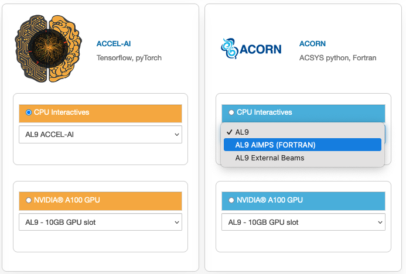

.. _accelerator:

ACORN/ACCEL-AI
=====================

|

ACORN CPU Only SL7 Interactive
-------------------------------
Image: acorn-notebook

Packages
~~~~~~~~~

.. table::
   :align: center

   +------------------------------------+----------------------------+----------------------------+------------------------------+-----------------------------+
   | .. centered:: xorg-x11-proto-devel | .. centered:: libX11-devel | .. centered:: libXau-devel | .. centered:: xorg-x11-xauth | .. centered:: xorg-x11-apps |
   +------------------------------------+----------------------------+----------------------------+------------------------------+-----------------------------+
   | .. centered:: xorg-x11-server-Xorg | .. centered:: cm-super     | .. centered:: libX11       | .. centered:: gcc            | .. centered:: nvcc          |
   +------------------------------------+----------------------------+----------------------------+------------------------------+-----------------------------+
   | .. centered:: jupyterlab-drawio    |  .. centered:: ffmpeg      | .. centered:: dvipng       | .. centered:: pytorch        | .. centered:: cpuonly       |
   +------------------------------------+----------------------------+----------------------------+------------------------------+-----------------------------+
   | .. centered:: jupyterlab-github    | .. centered:: bokeh        | .. centered:: tqdm         | .. centered:: cython         | .. centered:: h5py          |
   +------------------------------------+----------------------------+----------------------------+------------------------------+-----------------------------+
   | .. centered:: matplotlib-base      | .. centered:: ipympl       | .. centered:: ipywidgets   | .. centered:: numba          | .. centered:: numexpr       |
   +------------------------------------+----------------------------+----------------------------+------------------------------+-----------------------------+
   | .. centered:: scikit-images        | .. centered:: numpy        | .. centered:: pandas       | .. centered:: pytz           | .. centered:: scipy         |
   +------------------------------------+----------------------------+----------------------------+------------------------------+-----------------------------+
   | .. centered:: scikit-learn         | .. centered:: cupy         | .. centered:: sympy        | .. centered:: acsys-py       | .. centered:: [settings]    |
   +------------------------------------+----------------------------+----------------------------+------------------------------+-----------------------------+

ACORN AIMPS AL9 Interactive
------------------------------
Image: AIMPS-notebook

Packages
~~~~~~~~~~

.. table:: 
   :align: center
   
   +----------------------------+------------------------+---------------------+
   | .. centered:: gcc-gfortran | .. centered:: lfortran | .. centered:: cmake |
   +----------------------------+------------------------+---------------------+

Accel-AI AL9 Interactive
---------------------------------
This environment has been merged from L-CAPE and READS SL7 notebooks and includes acsys functionality for access to control system data. It has a GPU equivalent which adds the following packages: 

Image: accel-ai-notebook

Packages (from L-CAPE)
~~~~~~~~~~

.. table:: 
   :align: center
   
   +------------------------------------+----------------------+-----------------------+----------------------------+------------------------+
   | .. centered:: tensorflow-estimator | .. centered:: ffmpeg | .. centered:: cpuonly | .. centered:: scikit-learn | .. centered:: cm-super |
   +------------------------------------+----------------------+-----------------------+----------------------------+------------------------+
   | .. centered:: tensorflow           | .. centered:: pandas | .. centered:: dvipng  | .. centered:: matplotlib   | .. centered:: pytorch  |
   +------------------------------------+----------------------+-----------------------+----------------------------+------------------------+
   | .. centered:: pytables             | .. centered:: h5py   | .. centered:: seaborn | .. centered:: dask         | .. centered:: hvplot   |
   +------------------------------------+----------------------+-----------------------+----------------------------+------------------------+
   | .. centered:: dask-ml              | .. centered:: numpy  | .. centered:: scipy   | .. centered:: sympy        | .. centered:: --       |
   +------------------------------------+----------------------+-----------------------+----------------------------+------------------------+

Packages (from READS)
~~~~~~~~~~

.. table:: 
   :align: center
   
   +-------------------------------+--------------------------+----------------------------+----------------------------+------------------------+
   | .. centered:: matplotlib-base | .. centered:: ipywidgets | .. centered:: scikit-image | .. centered:: scikit-learn | .. centered:: cm-super |
   +-------------------------------+--------------------------+----------------------------+----------------------------+------------------------+
   | .. centered:: ffmpeg          | .. centered:: dvipng     | .. centered:: pytorch      | .. centered:: cpuonly      | .. centered:: bokeh    |
   +-------------------------------+--------------------------+----------------------------+----------------------------+------------------------+
   | .. centered:: tqdm            | .. centered:: cython     | .. centered:: h5py         | .. centered:: ipympl       | .. centered:: numba    |
   +-------------------------------+--------------------------+----------------------------+----------------------------+------------------------+
   | .. centered:: numexpr         | .. centered:: numpy      | .. centered:: pandas       | .. centered:: pytz         | .. centered:: scipy    |
   +-------------------------------+--------------------------+----------------------------+----------------------------+------------------------+
   | .. centered:: cupy            | .. centered:: sympy      | .. centered:: --           | .. centered:: --           | .. centered:: --       |
   +-------------------------------+--------------------------+----------------------------+----------------------------+------------------------+

The generic ACCEL-AI image has a GPU equivalent which adds the following packages:

Packages
~~~~~~~~~~

.. table:: 
   :align: center
   
   +---------------------------+---------------------+------------------------------+--------------------+
   | .. centered:: cudatoolkit | .. centered:: cudnn | .. centered:: tensorflow-gpu | .. centered:: nvcc |
   +---------------------------+---------------------+------------------------------+--------------------+
