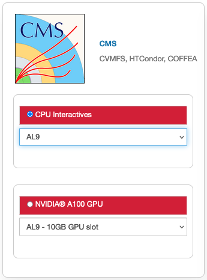

.. _cms:

CMSLPC
=====================

|

AL9 Interactive
-----------------
Image: cmslpc-notebook

Packages
~~~~~~~~~~

.. table:: 
   :align: center
   
   +------------------------+-----------------------------+------------------------------+-----------------------------+----------------------------+
   | .. centered:: make     | .. centered:: cmake3        | .. centered:: gcc-c++        |  .. centered:: voms-client  |  .. centered:: HTCondor    |
   +------------------------+-----------------------------+------------------------------+-----------------------------+----------------------------+
   | .. centered:: gcc      | .. centered:: osg-wn-client | .. centered::  xrootd-client |  .. centered:: eos-client   |  .. centered:: eos-xrootd  |
   +------------------------+-----------------------------+------------------------------+-----------------------------+----------------------------+

COFFEA-DASK AL9 Interactive
------------------------------
For more information on various versions of COFFEA. Check the dedicated page for setting up your `Dask on EAF <https://eafjupyter.readthedocs.io/en/latest/02_batch_dask_cms.html#logging-in-and-setting-up>`_.

Image: cmslpc-coffea-dask

Packages
~~~~~~~~~~

.. table:: 
   :align: center
   
   +---------------------------------------+-----------------------------+------------------------------+------------------------------+-------------------------------+
   | .. centered:: conda-build             | .. centered:: ipymp         | .. centered:: aiohttp        | .. centered:: click          | .. centered:: dask            |
   +---------------------------------------+-----------------------------+------------------------------+------------------------------+-------------------------------+
   | .. centered:: distributed             | .. centered:: pyyaml        | .. centered:: tornado        | .. centered:: numpy          | .. centered:: dask-gateway    |
   +---------------------------------------+-----------------------------+------------------------------+------------------------------+-------------------------------+
   | .. centered:: scikit-hep-testdata     | .. centered:: iminuit       | .. centered:: uproot         | .. centered:: ipywidgets     | .. centered:: traitlets       |
   +---------------------------------------+-----------------------------+------------------------------+------------------------------+-------------------------------+
   | .. centered:: dask-labextension       | .. centered:: ca-policy-lcg | .. centered:: cmake          |  .. centered:: xrootd        |  .. centered:: mplhep         |
   +---------------------------------------+-----------------------------+------------------------------+------------------------------+-------------------------------+
   | .. centered:: dask-jobqueue           | .. centered:: coffea        | .. centered:: vector         |  .. centered:: xgboost       |  .. centered:: hist           |
   +---------------------------------------+-----------------------------+------------------------------+------------------------------+-------------------------------+
   | .. centered:: python-rapidjson        | .. centered:: lz4           | .. centered:: pytables       |  .. centered:: pyhf          |  .. centered:: brotli         |
   +---------------------------------------+-----------------------------+------------------------------+------------------------------+-------------------------------+
   | .. centered:: geventhttpclient        | .. centered:: grpcio        | .. centered:: funcx          |  .. centered:: python-xhash  |  .. centered:: fastjet        |
   +---------------------------------------+-----------------------------+------------------------------+------------------------------+-------------------------------+
   | .. centered:: servicex-databinder     | .. centered:: zstandard     | .. centered:: tritonclient   |  .. centered:: aiostream     |  .. centered:: cabinetry      |
   +---------------------------------------+-----------------------------+------------------------------+------------------------------+-------------------------------+
   | .. centered:: func-adl-servicex       | .. centered:: protobuf      | .. centered:: tflite_runtime |  .. centered:: tenacity      |  .. centered:: HTCondor       |
   +---------------------------------------+-----------------------------+------------------------------+------------------------------+-------------------------------+
   | .. centered:: func-adl-uproot         | .. centered:: onnxruntime   | .. centered:: htcdaskgateway |  .. centered:: correctionlib |  .. centered:: tcut-to-qastle |
   +---------------------------------------+-----------------------------+------------------------------+------------------------------+-------------------------------+

GPU AL9 Interactive (NVIDIA Ampere A100) and GPU AL9 Interactive (NVIDIA Ampere A100) [20GB GPU]
--------------------------------------------------------------------------------------------------
Image: cmslpc-notebook (GPU)

Packages
~~~~~~~~~~
.. table:: 
   :align: center
   
   +---------------------------------------+------------------------------+------------------------------+-------------------------------+------------------------------------+
   | .. centered:: cudatoolkit             | .. centered:: cudnn          | .. centered:: pytorch        | .. centered:: mpi4py          | .. centered:: awkward-cuda-kernals |
   +---------------------------------------+------------------------------+------------------------------+-------------------------------+------------------------------------+
   | .. centered:: tensorflow-gpu          | .. centered:: nccl           | .. centered:: bokeh          | .. centered:: tqdm            | .. centered:: nsight-systems       |
   +---------------------------------------+------------------------------+------------------------------+-------------------------------+------------------------------------+
   | .. centered:: cython                  | .. centered:: akward         | .. centered:: h5py           | .. centered:: ipympl          | .. centered:: nvcc                 |
   +---------------------------------------+------------------------------+------------------------------+-------------------------------+------------------------------------+
   | .. centered:: matplotlib-base         | .. centered:: scikit-image   | .. centered:: scikit-learn   | .. centered:: scipy           | .. centered:: sympy                | 
   +---------------------------------------+------------------------------+------------------------------+-------------------------------+------------------------------------+
   | .. centered:: tensorboard-pro         | .. centered:: cupy           | .. centered::  ---           |  .. centered::  ---           | .. centered::  ---                 |
   +---------------------------------------+------------------------------+------------------------------+-------------------------------+------------------------------------+

CVMFS
------

.. table:: 
   :align: center
   
   +-------------------------------------------+-----------------------------------------+
   | .. centered:: cms.cern.ch                 | .. centered:: oasis.opensciencegrid.org |
   +-------------------------------------------+-----------------------------------------+
   | .. centered:: cms-lpc.opensciencegrid.org | .. centered:: unpacked.cern.ch          |
   +-------------------------------------------+-----------------------------------------+
