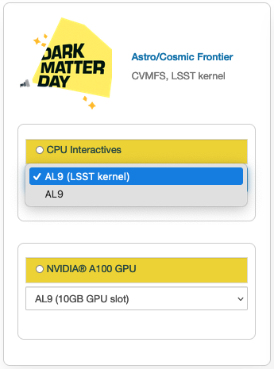

.. _astro:

Cosmic Frontier
=====================

) [20GB GPU], and the fourth option is GPU AL9 Interactive (NVIDIA Ampere A100) [40GB GPU].
   
|   
   
AL9 Interactive General Purpose Notebook
------------------------------------------
Image: astro-notebook

Packages
~~~~~~~~~~

.. table:: 
   :align: center
   
   +-------------------------------------+--------------------------------+-------------------------------+----------------------------+-----------------------------+
   | .. centered:: yum-plugin-priorities | .. centered:: krb5-workstation | .. centered:: redhat-lsb-core | .. centered:: libX11-devel | .. centered:: openssl-devel |
   +-------------------------------------+--------------------------------+-------------------------------+----------------------------+-----------------------------+
   | .. centered:: xrootd-client-libs    | .. centered:: make             | .. centered:: cmake3          | .. centered:: gcc-c++      | .. centered:: gcc           |
   +-------------------------------------+--------------------------------+-------------------------------+----------------------------+-----------------------------+
   | .. centered:: voms-clients-cpp      | .. centered:: binutils         | .. centered:: libXpm-devel    | .. centered:: libXft-devel | .. centered:: libXext-devel |
   +-------------------------------------+--------------------------------+-------------------------------+----------------------------+-----------------------------+
   | .. centered:: osg-wn-client         | .. centered:: xrootd-client    | .. centered:: voms            | .. centered:: HTCondor     | .. centered:: xxhash-libs   |
   +-------------------------------------+--------------------------------+-------------------------------+----------------------------+-----------------------------+

GPU AL9 Interactive (NVIDIA Ampere A100), GPU AL9 Interactive (NVIDIA Ampere A100) [20GB GPU], and GPU AL9 Interactive (NVIDIA Ampere A100) [40GB GPU]
-------------------------------------------------------------------------------------------------------------------------------------------------------
Image: astro-notebook (GPU)

Packages
~~~~~~~~~~

.. table:: 
   :align: center
   
   +------------------------------------------+------------------------------+---------------------------+-------------------------------+----------------------------+
   | .. centered:: jupyterlab-tensorboard-pro | .. centered:: tensorflow-gpu | .. centered:: cudatoolkit | .. centered:: matplotlib-base | .. centered:: scikit-image |
   +------------------------------------------+------------------------------+---------------------------+-------------------------------+----------------------------+
   | .. centered:: scikit-learn               | .. centered:: cudnn          | .. centered:: pytorch     | .. centered:: mpi4py          | .. centered:: nccl         |
   +------------------------------------------+------------------------------+---------------------------+-------------------------------+----------------------------+
   | .. centered:: bokeh                      | .. centered:: tqdm           | .. centered:: cython      | .. centered:: awkward         | .. centered:: h5py         |
   +------------------------------------------+------------------------------+---------------------------+-------------------------------+----------------------------+
   | .. centered:: ipympl                     | .. centered:: scipy          | .. centered:: cupy        | .. centered:: sympy           | .. centered:: nvcc         |
   +------------------------------------------+------------------------------+---------------------------+-------------------------------+----------------------------+

LSST
-----------------------------------------------------
EAF offers a container image with the LSST jupyterhub kernel enabled

Packages
~~~~~~~~~~

.. table:: 
   :align: center
   
   +-------------------------------------+--------------------------------+-------------------------------+-----------------------------+--------------------------------+
   | .. centered:: yum-plugin-priorities | .. centered:: krb5-workstation | .. centered:: redhat-lsb-core | .. centered:: binutils      | .. centered:: voms-clients-cpp |
   +-------------------------------------+--------------------------------+-------------------------------+-----------------------------+--------------------------------+
   | .. centered:: xrootd-client-libs    | .. centered:: make             | .. centered:: cmake3          | .. centered:: gcc-c++       | .. centered:: gcc              |
   +-------------------------------------+--------------------------------+-------------------------------+-----------------------------+--------------------------------+
   | .. centered:: lsst-jupyter-kernel   | .. centered:: libXft-devel     | .. centered:: libXext-devel   | .. centered:: openssl-devel | .. centered:: nss_wrapper      |
   +-------------------------------------+--------------------------------+-------------------------------+-----------------------------+--------------------------------+
   | .. centered:: gettext               | .. centered:: osg-wn-client    | .. centered:: xrootd-client   | .. centered:: voms          | .. centered:: libXpm-devel     |
   +-------------------------------------+--------------------------------+-------------------------------+-----------------------------+--------------------------------+
   | .. centered:: HTCondor              | .. centered:: xxhash-libs      | .. centered:: libX11-devel    | .. centered:: cvmfs-lsst    | .. centered:: --               |
   +-------------------------------------+--------------------------------+-------------------------------+-----------------------------+--------------------------------+

CVMFS
------

.. table:: 
   :align: center
   
       +-----------------------------------------+--------------------------------------------+
       | .. centered:: oasis.opensciencegrid.org | .. centered:: fermilab.opensciencegrid.org |
       +-----------------------------------------+--------------------------------------------+
       | .. centered:: admx.opensciencegrid.org  | .. centered:: darkside.opensciencegrid.org |
       +-----------------------------------------+--------------------------------------------+
       | .. centered:: des.opensciencegrid.org.  | .. centered:: sw.lsst.eu                   |
       +-----------------------------------------+--------------------------------------------+
