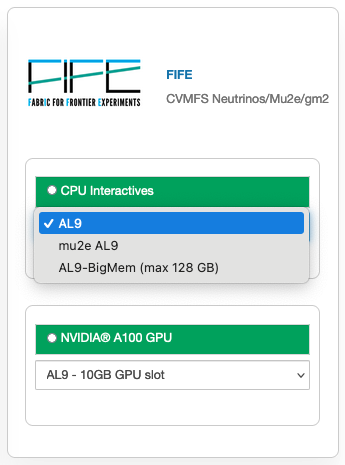

.. _fife:

FIFE/Neutrinos
=====================

100) [20GB GPU].

|

AL9 Interactive General Purpose Notebook
------------------------------------------
Image: fife-notebook

Packages
~~~~~~~~~~

.. table:: 
   :align: center
   +--------------------------------------+-------------------------------+------------------------------+---------------------------+-----------------------------+
   | .. centered:: krb5-workstation       | .. centered:: redhat-lsb-core | .. centered:: make           | .. centered:: nss_wrapper | .. centered:: libXext-devel |
   +--------------------------------------+-------------------------------+------------------------------+---------------------------+-----------------------------+
   | .. centered:: yum-plugin-priorities  | .. centered:: cmake3          | .. centered:: gcc-c++        | .. centered:: HTCondor    | .. centered:: libXpm-devel  | 
   +--------------------------------------+-------------------------------+------------------------------+---------------------------+-----------------------------+
   | .. centered:: xrootd-client-libs     | .. centered:: gcc             | .. centered:: binutils       | .. centered:: gettext     | .. centered:: libXft-devel  |    
   +--------------------------------------+-------------------------------+------------------------------+---------------------------+-----------------------------+
   | .. centered:: voms-client-cpp        | .. centered:: osg-wn-client   | .. centered:: libX11-devel   | .. centered:: voms        | .. centered:: openssl-devel |
   +--------------------------------------+-------------------------------+------------------------------+---------------------------+-----------------------------+
   | .. centered:: xrootd-client          | .. centered:: --              | .. centered:: --             | .. centered:: --          | .. centered:: --            |
   +--------------------------------------+-------------------------------+------------------------------+---------------------------+-----------------------------+

GPU AL9 Interactive (NVIDIA Ampere A100) and GPU AL9 Interactive (NVIDIA Ampere A100) [20GB GPU]
--------------------------------------------------------------------------------------------------
Image: fife-notebook (GPU)

Packages
~~~~~~~~~~

.. table:: 
   :align: center
   
   +------------------------------------------+-----------------------+---------------------------+---------------------------+---------------------+
   | .. centered:: jupyterlab-tensorboard-pro | .. centered:: pytorch | .. centered:: torchvision | .. centered:: cudatoolkit | .. centered:: cudnn |
   +------------------------------------------+-----------------------+---------------------------+---------------------------+---------------------+
   | .. centered:: tensorflow-gpu             | .. centered:: mpi4py  | .. centered:: ipympl      | .. centered:: bokeh       | .. centered:: tqdm  |
   +------------------------------------------+-----------------------+---------------------------+---------------------------+---------------------+
   | .. centered:: matplotlib-base            | .. centered:: cython  | .. centered:: ipywidgets  | .. centered:: pandas      | .. centered:: nccl  |
   +------------------------------------------+-----------------------+---------------------------+---------------------------+---------------------+
   | .. centered:: scikit-image               | .. centered:: numba   | .. centered:: numexpr     | .. centered:: numpy       | .. centered:: h5py  |
   +------------------------------------------+-----------------------+---------------------------+---------------------------+---------------------+
   | .. centered:: scikit-learn               | .. centered:: pytz    | .. centered:: scipy       | .. centered:: yum-utils   | .. centered:: sympy |
   +------------------------------------------+-----------------------+---------------------------+---------------------------+---------------------+
   | .. centered:: nvcc                       | .. centered:: --      | .. centered:: --          | .. centered:: --          | .. centered:: --    |
   +------------------------------------------+-----------------------+---------------------------+---------------------------+---------------------+

CVMFS
------

.. table:: 
   :align: center

   +----------------------------------------------------+--------------------------------------------+
   | .. centered:: oasis.opensciencegrid.org            | .. centered:: fermilab.opensciencegrid.org | 
   +----------------------------------------------------+--------------------------------------------+
   | .. centered:: icarus.opensciencegrid.org           | .. centered:: lariat.opensciencegrid.org   | 
   +----------------------------------------------------+--------------------------------------------+
   | .. centered:: minerva.opensciencegrid.org          | .. centered:: minos.opensciencegrid.org    |
   +----------------------------------------------------+--------------------------------------------+
   | .. centered:: nova-development.opensciencegrid.org | .. centered:: nova.opensciencegrid.org     | 
   +----------------------------------------------------+--------------------------------------------+
   | .. centered:: sbn.opensciencegrid.org              | .. centered:: seaquest.opensciencegrid.org | 
   +----------------------------------------------------+--------------------------------------------+
   | .. centered:: gm2.opensciencegrid.org              | .. centered:: larsoft.opensciencegrid.org  |
   +----------------------------------------------------+--------------------------------------------+
   | .. centered:: mu2e.opensciencegrid.org             | .. centered:: sbnd.opensciencegrid.org     | 
   +----------------------------------------------------+--------------------------------------------+
   | .. centered:: uboone.opensciencegrid.org           | .. centered:: --                           |
   +----------------------------------------------------+--------------------------------------------+

