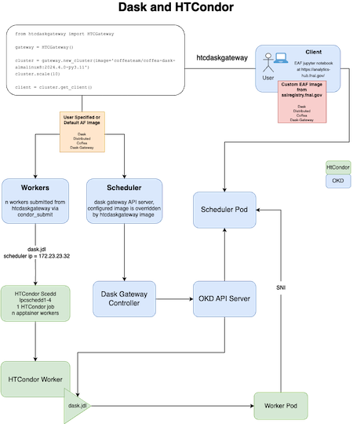
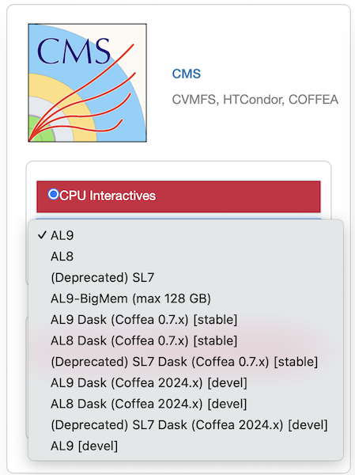

******************************************
Dask at Fermilab's EAF (CMS Accounts)
******************************************

In alignment with IRIS-HEP and the USCMS LHC project COFFEA, EAF has deployed a centralized instance of Dask Gateway to enable fast, reliable and distributed python data processing powered by the LPC batch cluster and Openshift Kubernetes.

.. image:: img/eaf-facility.png
  :alt: Named Servers

We have developed a client around Dask Gateway to facilitate user interaction with the Batch cluster. The COFFEA-Dask notebooks have the latest version installed. If you are interesting in checking out the code or release information, here are the links:

* Source repo: `HTCDaskgateway <https://github.com/mapsacosta/htcdaskgateway>`_
* Releases : `Pypi <https://pypi.org/project/htcdaskgateway/>`_ 

Get Started with Dask
======================
.. warning::
  You MUST have have an active CMS LPC account. For instructions on how to obtain one please go to the `LPC computing website <https://uscms.org/uscms_at_work/physics/computing/getstarted/getaccount_fermilab.shtml>`_. Non-CMS dask is a work in progress, if you are not able to obtain an LPC account due to experiment affiliation, please contact us via :doc:`slack or email <index>`. 

.. _how it works:

How It Works
-------------

Before you start connecting, there are some things to know about our dask system, and dask in general, that will help with both utilizing the htcdaskgateway system and understand errors. There are three important images that are used by dask: client image, worker image, and scheduler image. For the EAF, the client image is the image being used by your notebook. It is either specified by the server option you choose when logging in or can be specified by you. The worker image is the image you give to the workers to use when you call the htcdaskgateway. Lastly, the scheduler image is the image configured by htcdaskgateway when it is called, similar to the worker. 

Depending on your use case, you may be changing all of these images so it is important to understand how they work together. For dask to successfully run your jobs, each of these images should match, meaning they need to have the same packages installed. With htcdaskgateway, you have the ability to change both the worker and scheduler images. You can also change the client image through custom environments. 

.. Note::
  The images need to be mostly the same, they can have different packages but these can lead to errors and issues running your code. The images MUST have the same major.minor (i.e. 3.10) python versions and the same dask, dask-gateway and dask-distributed versions. 

Here is a diagram detailing how our dask system works:

s specified either by the default in htcdaskgateway or by the user in the code calling htcdaskgateway. The workers are connected to the HTCondor schedd and are connected to the worker pod through a dask.jdl file. This file also connects the worker to the OKD API server. The worker pod and API server are then connected to the shecduler pod that talks to the client notebook. The scheduler is connected to the dask gateway controller that connects to the API server as well. This then connects to the scheduler pod that talks to the client. So we have the client start workers as htcondor workers and connect to the scheduler. 

Logging In and Setting Up
==========================
If you are new to the EAF, be sure to follow the :doc:`Quickstart <index>` for log-in information or :doc:`EAF Access and Accounts <00_user_accounts>` to gain access to the EAF. 

Once logged in, you will need to choose a notebook. Only notebooks with "DASK" in the name will be able to use the HTCondor dask cluster. Notebooks labeled [stable] work out of the box with the htcdaskgateway cluster code. The following are dask enabled notebooks:

* AL9 Dask (Coffea 0.7.x) [stable] 
* AL8 Dask (Coffea 0.7.x) [stable] 
* AL9 Dask (Coffea 2024.x) [devel] 
* AL8 Dask (Coffea 2024.x) [devel] 

In the server options on EAF you will see this:

.. Note::
  You do NOT need to be a coffea user to access dask. Any of these notebooks can be used for other custom environments within the notebooks. See :ref:`Using Dask with Non-Default Image <nondefault image>`.

<<<<<<< HEAD
You can either use dask with the installation default or you can use an image of your choice. The default image is coffeateam/coffea-base-almalinux8:0.7.22-py3.10, here is a brief summary of the installed packages:
=======
You can either use dask with the installation default or you can use an image of your choice. The default image is coffeateam/coffea-dask-almalinux8:2024.4.0-py3.10, here is a brief summary of the installed packages:
>>>>>>> master

.. csv-table::
   :file: /csvfiles/coffea_image_table.csv
   :widths: 30,30,30,30,30
   :header-rows: 0

For more details, you can use either docker or github to learn more about this image:

<<<<<<< HEAD
* `Docker link to Default Image <https://hub.docker.com/layers/coffeateam/coffea-base-almalinux8/0.7.22-py3.10/images/sha256-fa7ed8a997d8a34e98e2ce309a88d9658e64d52ff3d500994cc6f7097b40da30?context=explore>`_. 
=======
* `Docker link to Default Image <https://hub.docker.com/layers/coffeateam/coffea-dask-almalinux8/2024.4.0-py3.10/images/sha256-a9516771d340e8ef56ff75fea8e2a3be8dcbe77f5085e038652d11c6b872cd1b?context=explore>`_. 
>>>>>>> master
* `Github link to Default Image <https://github.com/CoffeaTeam/docker-coffea-dask/blob/main/dask-almalinux8/Dockerfile>`_. 

For using the default image, follow the instructions in :ref:`Using Dask with Default Image <default image>`. For using a non-default image, follow the instructions in :ref:`Using Dask with Non-Default Image <nondefault image>`.

Step-by-Step Instructions
==========================

.. important::
<<<<<<< HEAD
  Coffea 2024.x users must use a non-default image. Go to :ref:`Using Dask with Non-Default Image <nondefault image>`.
=======
  Coffea 0.7.x users must use a non-default image. Go to :ref:`Using Dask with Non-Default Image <nondefault image>`.
>>>>>>> master

.. _default image:

Using Dask with Default Image
-----------------------------

#. Log in to the EAF and select one of the following servers:

<<<<<<< HEAD
   * AL9 Dask (Coffea 0.7.x) [stable] 
   * AL8 Dask (Coffea 0.7.x) [stable] 
=======
   * AL9 Dask (Coffea 2024.x) [devel] 
   * AL8 Dask (Coffea 2024.x) [devel] 
>>>>>>> master

#. Make sure you have a voms proxy. Here is the `voms CMS Twiki <https://twiki.cern.ch/twiki/bin/view/CMSPublic/WorkBookStartingGrid>`_ if you need help.

#. Open a jupyterhub notebook and copy in the following code:
   
   .. code-block:: python

    from htcdaskgateway import HTCGateway

    gateway = HTCGateway()

    cluster = gateway.new_cluster()
    cluster.scale(10)

    client = cluster.get_client()
  
   .. important::
     Do NOT forget to shut down your cluster, see step 5.

#. You are now connected to our batch cluster! 
   
   .. important::
      If your cluster is not working, please contact us via :doc:`slack or email <index>`. Note that if you need to use a different image, go to :ref:`Using Dask with Non-Default Image <nondefault image>`.

#. You must shutdown your cluster once you are finished using it. Add this line of code when you are finished with your workers. 
   
   .. code-block:: python

    cluster.shutdown()

.. _nondefault image:

Using Dask with Non-Default Image
---------------------------------

.. warning::
  The image you want to use MUST be in cvmfs. You can check cvmfs using:
  
  .. code-block:: bash

    ls /cvmfs/unpacked.cern.ch/registry.hub.docker.com/

  If your image is not in cvmfs, please contact us via :doc:`slack or email <index>`.

For a non-default image, there are a few extra steps in order to make sure your jobs won't fail. See :ref:`How It Works <how it works>` to better understand the extra steps. 

#. Log in to the EAF and select one of the following servers:

   * AL9 Dask (Coffea 0.7.x) [stable] 
   * AL8 Dask (Coffea 0.7.x) [stable] 
   * AL9 Dask (Coffea 2024.x) [devel] 
   * AL8 Dask (Coffea 2024.x) [devel] 
<<<<<<< HEAD
=======
  
   If you are a coffea 2024.x user, go to step 2. If not, go to step 3.

#. The client image aka the server image may or may not be compatible with your image. Most coffeateam/coffea-dask-almalinux8 images are compatible that have matching coffea versions and python versions. For Coffea 0.7.x, the current known working image is: coffeateam/coffea-base-almalinux8:0.7.22-py3.10. Continue to step 4.
>>>>>>> master

#. The client image aka the server image is not compatible with your image. This means you will need to set up a custom environment for your jupyter notebook. See :doc:`Customizing User Environments <02_customization>` for how to do this. Particularly, "Example: installing biopython in the snowflakes conda environment". You can still pip/mamba/conda install in your environment once you activate it. 
   
#. Make sure you have a voms proxy. Here is the `voms CMS Twiki <https://twiki.cern.ch/twiki/bin/view/CMSPublic/WorkBookStartingGrid>`_ if you need help.
   
#. Open a jupyterhub notebook and copy in the following code, REPLACE <your_image_repo/your_image_name> with your image:
   
   .. code-block:: python

    from htcdaskgateway import HTCGateway

    gateway = HTCGateway()

    cluster = gateway.new_cluster(image='<your_image_repo/your_image_name>')
    cluster.scale(10)

    client = cluster.get_client()

   .. important::
    Do NOT forget to shut down your cluster, see step 7.

<<<<<<< HEAD
=======
   .. note::
    COFFEA USERS: If your cluster is not working, please try step 3.

>>>>>>> master
#. You are now connected to our batch cluster!
   
   .. important::
      If your cluster is not working, please contact us via :doc:`slack or email <index>`. In the message, please specify the image you are trying to use. 

#. You must shutdown your cluster once you are finished using it. Add this line of code when you are finished with your workers. 
   
   .. code-block:: python

    cluster.shutdown()

.. toctree::
   :maxdepth: 2
   :caption: Contents:

   notebooks/EAF-htcdaskgateway.ipynb
