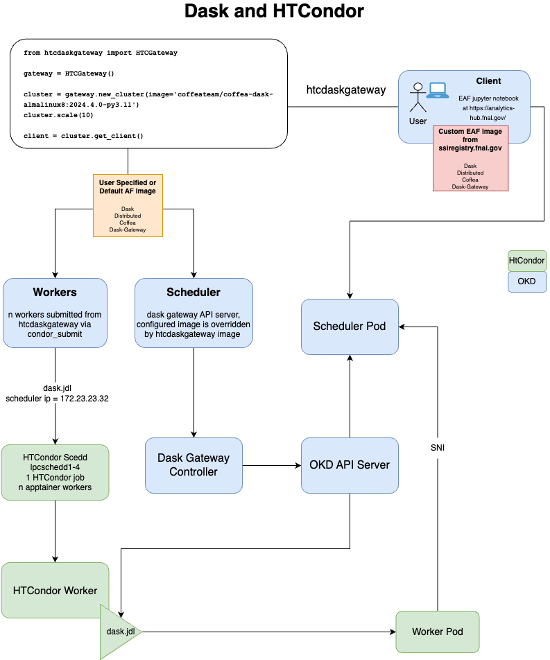

*********
Dask at Fermilab's EAF
*********

In alignment with IRIS-HEP and the USCMS LHC project COFFEA, EAF has deployed a centralized instance of Dask Gateway to enable fast, reliable and distributed python data processing powered by the LPC batch cluster and Openshift Kubernetes.

.. image:: img/eaf-facility.png
  :alt: Named Servers

We have developed a client around Dask Gateway to facilitate user interaction with the Batch cluster. The COFFEA-Dask notebook has the latest version installed. If you are interesting in checking out the code or release information, here are the links:
* Source repo: `HTCDaskgateway <https://github.com/mapsacosta/htcdaskgateway>`_
* Releases : `Pypi <https://pypi.org/project/htcdaskgateway/>`_ 

Get Started with Dask
======================
.. warning::
  You MUST have have an active CMS LPC account. For instructions on how to obtain one please go to the `LPC computing website <https://uscms.org/uscms_at_work/physics/computing/getstarted/getaccount_fermilab.shtml>`_.

If you are new to the EAF, be sure to follow the :doc:`Quickstart </source/index>` for log-in information or :doc:`EAF Access and Accounts </source/00_user_accounts>` to gain access to the EAF. 

How it Works
-------------
Before you start connecting, there are some things to know about our dask system, and dask in general, that will help with both utilizing the htcdaskgateway system and understanding errors. There are three important images that are used by dask: client image, worker image, and scheduler image. For the EAF, the client image is the image being used by your notebook. It is either specified by the server option you choose when logging in or can be specified by you. The worker image is the image you give to the workers to use when you call the htcdaskgateway. Lastly, the scheduler image is the image pre-configured by htcdaskgateway when it is called, similar to the worker. 

Depending on your use case, you may be changing all three of these images so it is important to understand how they work together. For dask to successfully run your jobs, each of these images must match. With htcdaskgateway, you have the ability to change both the worker and scheduler images. You can also change the client image through custom environments. 

Here is a diagram detailing how htcdaskgateway works:

Once logged in, you will need to choose a notebook. Only notebooks with "DASK" in the name will be able to use the HTCondor dask cluster. The following are dask enabled notebooks:
* AL9 Dask (Coffea 0.7.x) [stable] 
* AL8 Dask (Coffea 0.7.x) [stable] 
* SL7 Dask (Coffea 0.7.x) [stable] 
* AL9 Dask (Coffea 2024.x) [devel] 
* AL8 Dask (Coffea 2024.x) [devel] 
* SL7 Dask (Coffea 2024.x) [devel] 

.. image:: img/dask_notebook_options.png
  :alt: Image of the server options with the dask enabled notebooks marked with a red box.

If you are unsure which notebook to use, go to :doc:`Getting started - Choosing a Notebook </source/00_getting_started>`. These notebooks have coffea pre-installed along with HTCondor command-line tools and libraries necessary for interacting with our instance of dask.

.. Note::
  You do NOT need to be a coffea user to access dask. Any of these notebooks can be used for other custom environments within the notebooks. See Using Dask with Non-Default Image.

Once you have decided which notebook works best for your use case, you can either use dask with the installation default or you can use an image of your choice. The default image is coffeateam/coffea-dask-almalinux8:2024.4.0-py3.10, here is a brief summary of the installed packages:

.. table:: 
   :align: center
   +--------------------------------------+-------------------------------+------------------------------+---------------------------+-----------------------------+
   | .. centered:: krb5-workstation       | .. centered:: redhat-lsb-core | .. centered:: make           | .. centered:: nss_wrapper | .. centered:: libXext-devel |
   +--------------------------------------+-------------------------------+------------------------------+---------------------------+-----------------------------+
   | .. centered:: yum-plugin-priorities  | .. centered:: cmake3          | .. centered:: gcc-c++        | .. centered:: HTCondor    | .. centered:: libXpm-devel  | 
   +--------------------------------------+-------------------------------+------------------------------+---------------------------+-----------------------------+
   | .. centered:: xrootd-client-libs     | .. centered:: gcc             | .. centered:: binutils       | .. centered:: gettext     | .. centered:: libXft-devel  |    
   +--------------------------------------+-------------------------------+------------------------------+---------------------------+-----------------------------+
   | .. centered:: voms-client-cpp        | .. centered:: osg-wn-client   | .. centered:: libX11-devel   | .. centered:: voms        | .. centered:: openssl-devel |
   +--------------------------------------+-------------------------------+------------------------------+---------------------------+-----------------------------+
   | .. centered:: xrootd-client          | .. centered:: --              | .. centered:: --             | .. centered:: --          | .. centered:: --            |
   +--------------------------------------+-------------------------------+------------------------------+---------------------------+-----------------------------+

For more details, you can use either docker or github to learn more about this image:

- `Docker link to Default Image <https://hub.docker.com/layers/coffeateam/coffea-dask-almalinux8/2024.4.0-py3.10/images/sha256-a9516771d340e8ef56ff75fea8e2a3be8dcbe77f5085e038652d11c6b872cd1b?context=explore>`_. 
- `Github link to Default Image <https://github.com/CoffeaTeam/docker-coffea-dask/blob/main/dask-almalinux8/Dockerfile>`_. 

For using the default image, follow the instructions in :ref:`Using Dask with Default Image <default image>`. For using a non-default image, follow the instructions in :ref:`Using Dask with Non-Default Image <nondefault image>`. To help with figuring out which you need, you can use this flowchart:

Using Dask with Default Image
-----------------------------
.. _default image:

Using Dask with Non-Default Image
-----------------------------
.. _nondefault image:

.. toctree::
   :maxdepth: 2
   :caption: Contents:

   notebooks/EAF-htcdaskgateway.ipynb
