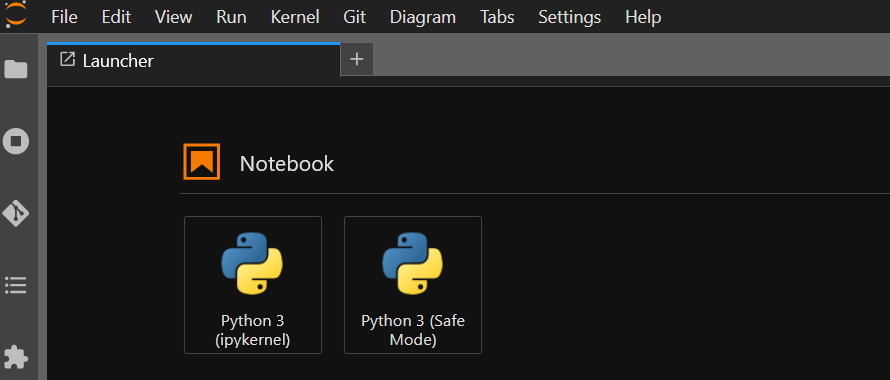
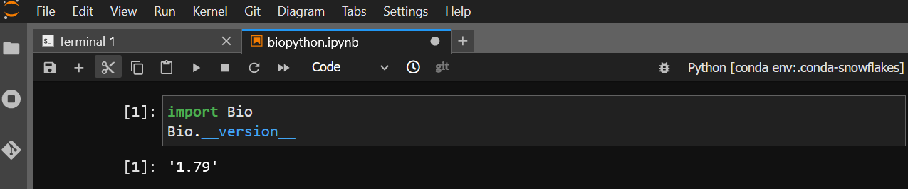

**********************************************
Customizing user environments with conda/mamba
**********************************************

It is possible to customize your environment using anaconda and access that environment in your notebooks.

Configuring conda/mamba (only needed once)
==========================================

From a terminal launcher, run ``mamba init``. Then, create a ``.profile` in your home directory with
the following content::

  # Get the aliases and functions
  if [ -f ~/.bashrc ]; then
      . ~/.bashrc
  fi

Using conda/mamba
=================

Conda is well-documented at https://conda.io (its use is outside the scope of this documentation).  You can safely
substitute ``mamba`` for ``conda`` wherever it is listed; it is a faster reimplementation in C++ of conda.

Installing launchers
--------------------

You must install the `ipykernel` package in order to make your custom environment available as a notebook kernel. 
After a minute or so, a new launcher should appear corresponding to your environment; it may be necessary
to reload the web page.

Example: installing biopython in the `snowflakes` conda environment
=======================================================================

The vanilla launcher screen shows the two default launchers: python, and python-safemode.

We then install a new environment named `snowflakes`, including the `biopython` package::

   [burt@jupyter-burt-lpc ~]$ mamba create -q -y -n snowflakes biopython ipykernel
   Package                            Version  Build                Channel                    Size
   ────────────────────────────────────────────────────────────────────────────────────────────────────
   Install:
   ────────────────────────────────────────────────────────────────────────────────────────────────────
   
   + _libgcc_mutex                        0.1  conda_forge          conda-forge/linux-64     Cached
   + _openmp_mutex                        4.5  2_gnu                conda-forge/linux-64     Cached
   [ ... snipped for brevity ... ]
   + zeromq                             4.3.4  h9c3ff4c_1           conda-forge/linux-64     Cached
   
   Summary:
   
   Install: 66 packages
   
   Total download: 3MB
   
   ────────────────────────────────────────────────────────────────────────────────────────────────────
   
   Preparing transaction: ...working... done
   Verifying transaction: ...working... done
   Executing transaction: ...working... done

The newer launcher now appears, with its full name visible via tooltip, indicating the name of the conda environment:

.. image:: img/nb_conda_post.png
  :width: 400
  :alt: Launcher with new conda environments

And the Bio module from biopython is available:

Removing
^^^^^^^^^^^^^^^^^^^^^^

Donec non rutrum lorem. Aenean sagittis metus at pharetra fringilla. Nunc sapien dolor, cursus sed nisi at,
pretium tristique lectus. Sed pellentesque leo lectus, et convallis ipsum euismod a.

Document Paragraph
""""""""""""""""""

Mauris maximus viverra ante. Donec eu egestas mauris. Morbi vulputate tincidunt euismod. Integer vel porttitor neque.
Donec at lacus suscipit, lacinia lectus vel, sagittis lectus.
