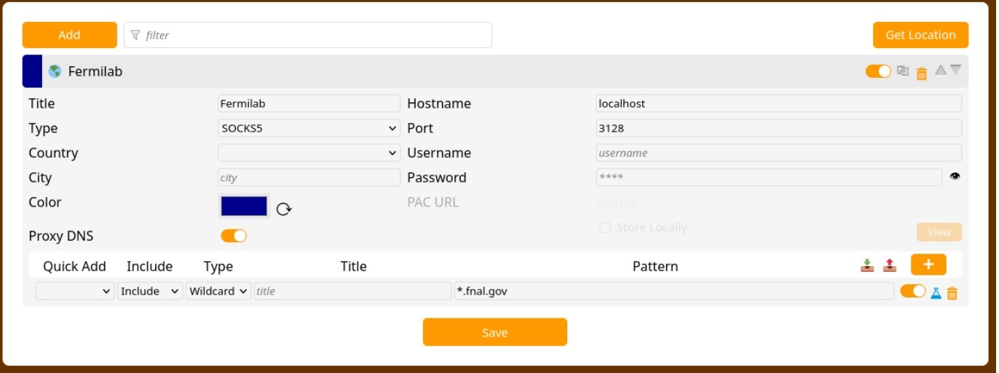

******************************
Web browser proxy for offsite access
******************************

.. important::

    Please be mindful of open-sessions:
       * When you're done using EAF, especially on shared or public computers, make sure to log out completely. This helps protect the facility and computing infrastructure from being accessed by others.

========
Instructions 
========

This is a TWO step process, please follow all the instructions before trying to reach EAF through your browser proxy.

Step 1. Set up the proxy in your browser
----------------------------------------

1. Download the FoxyProxy browser extension for `Chrome <https://chromewebstore.google.com/detail/foxyproxy/gcknhkkoolaabfmlnjonogaaifnjlfnp>`_ or `Firefox <https://addons.mozilla.org/en-US/firefox/addon/foxyproxy-standard/>`_

2. Navigate to the 'puzzle piece' extensions icon (top right) and select "Pin to Toolbar".

3. Click on the FoxyProxy extension icon, then enter its configuration page through the 'Options' button

   .. image:: img/foxy_extension.png

4. In the 'Proxies' tab, click 'Add' and enter the following values:

     * **Title**: ``Fermilab``
     * Select **SOCKS5** from the Proxy Type dropdown.
     * **Proxy IP address or DNS name**: ``localhost``
     * **Port**: ``3128`` (free to choose here but must match the tunnel created)

   * **URL patterns**:

     * Click the plus button next to **Pattern**.
     * Under **Pattern**, type ``*.fnal.gov``

   * Save

5. To let the browser know about the proxy, click on the FoxyProxy button on the toolbar and select
   "Proxy by Patterns".

#. You’re done! You should now notice the FoxyProxy button has a wireframe globe. To disable the proxy,
   click the button and select "Disable".

*Source*: https://library.fnal.gov/off-site-electronic-access-instructions/

Step 2. Get the SSH tunnel up
-----------------------------

1. Create a ssh tunnel to the CMSLPC/fnalu, using Putty or a shell run:

.. code-block:: console

   ssh -D 3128 your_user_name@fnalu.fnal.gov

2. `Click here to test and be redirected to EAF <https://analytics-hub.fnal.gov/>`_
